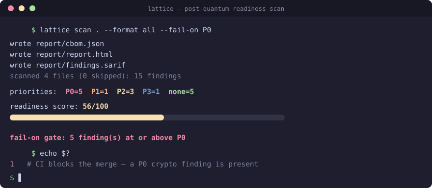
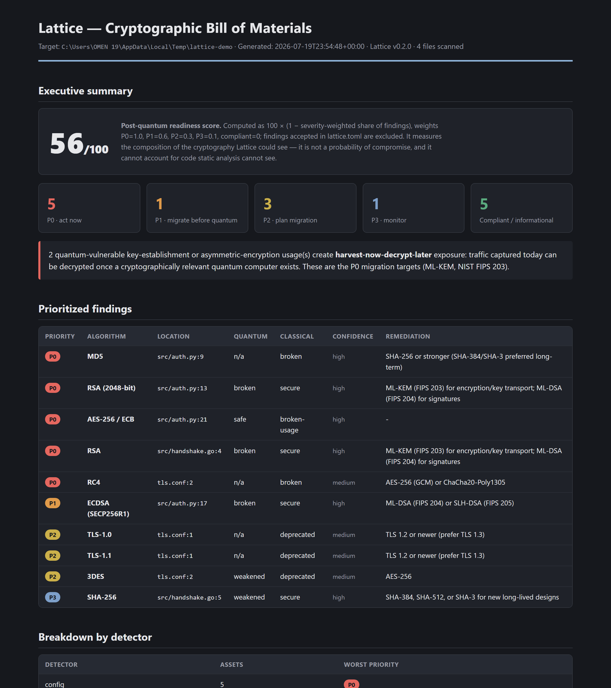

# Lattice

**Crypto-agility and post-quantum-readiness scanner.** Lattice statically analyzes a codebase,
produces a Cryptographic Bill of Materials (CBOM), grades every cryptographic usage for quantum
vulnerability and classical weakness, and emits a prioritized migration roadmap toward the NIST
post-quantum standards.


*New here? Start with the plain-language walkthrough:
[docs/PROJECT_EXPLAINED.md](docs/PROJECT_EXPLAINED.md).*

<p align="center">
  
</p>


**The post-quantum threat in three sentences.** Adversaries can record encrypted traffic today
and decrypt it once a cryptographically relevant quantum computer exists — *harvest now, decrypt
later*. Shor's algorithm breaks RSA, Diffie-Hellman, and all elliptic-curve cryptography
outright, while Grover's algorithm halves the effective strength of symmetric keys and hashes.
NIST has standardized the replacements — **ML-KEM (FIPS 203)** for key establishment and
**ML-DSA (FIPS 204)** / **SLH-DSA (FIPS 205)** for signatures — and migrating to them starts
with knowing what cryptography you actually have.

## What Lattice does

- **Builds a CBOM** — a CycloneDX-style inventory of every cryptographic asset it can find:
  algorithms in code, certificates and keys on disk, TLS configuration, crypto libraries in
  dependency manifests.
- **Grades each asset twice** — quantum status (Shor-broken / Grover-weakened / safe) and
  classical status (broken / deprecated / secure), then combines them into a migration priority
  (P0–P3) with a one-line justification.
- **Emits three formats** — CBOM JSON for compliance tooling, a self-contained HTML report for
  humans, and SARIF 2.1.0 for CI code-scanning UIs.
- **Gates merges** — `--fail-on P0` exits non-zero when critical findings exist.

Detectors: **Python** (AST-based), **Java/Kotlin** (JCA strings), **JavaScript/TypeScript**
(node:crypto, WebCrypto), **Go** (import map), **C/C++** (OpenSSL/mbedTLS/libsodium),
**Rust** (RustCrypto/openssl/ring), **C#/.NET** (System.Security.Cryptography),
**config & key material** (PEM/certs/keystores/TLS configs), **dependency manifests**
(requirements.txt, package.json, pom.xml, go.mod, Cargo.toml, and more).

Beyond scanning, Lattice is built for the *lifecycle* of a migration:

- **Accepted risks** (`lattice.toml`): suppress a finding *with a mandatory reason and
  optional expiry* — it stays in the CBOM and the HTML report, marked, but stops tripping CI.
  SARIF output carries standard `suppressions`, so code-scanning UIs handle it natively.
- **Drift detection** (`lattice diff old.json new.json --fail-on-new P0`): because output is
  deterministic, two CBOMs diff meaningfully — CI can block a PR that *introduces* weak
  crypto without failing on pre-existing findings.
- **Policy packs** (`--policy cnsa2`): evaluate findings against the CNSA 2.0 algorithm
  suite, orthogonally to the severity model.

Lattice is **defensive and offline**: it reads files locally, writes reports locally, makes no
network calls, never attempts to break cryptography, and never writes key material into a
report. See [docs/THREAT_MODEL.md](docs/THREAT_MODEL.md).

## Install

Requires Python 3.11+. Zero runtime dependencies (standard library only — every third-party
package is a supply-chain liability in a security tool). Lattice is not yet published to PyPI,
so install from source:

```bash
git clone https://github.com/mk12002/Lattice && cd Lattice
pip install .        # from the checkout
# or, for development:
pip install -e ".[dev]"
```

> If the `lattice` command isn't found after install, the console-script directory isn't on
> your `PATH`. Either add it, or run the tool as a module — `python -m lattice <args>` is
> equivalent to `lattice <args>`.

## Quickstart

```bash
lattice scan .                         # HTML report to ./lattice-report/report.html
lattice scan . --format all --out out  # CBOM + HTML + SARIF
lattice scan . --fail-on P0            # non-zero exit if anything critical exists
lattice rules list                     # print the full algorithm knowledge base
```

### What a scan looks like

Running Lattice over its own test fixtures:

```text
$ lattice scan tests/fixtures/python --format all --out report --fail-on P0
wrote report/cbom.json
wrote report/report.html
wrote report/findings.sarif
scanned 3 files (0 skipped): 4 findings
priorities: P0=2  P1=0  P2=0  P3=0  none=2
readiness score: 50/100
fail-on gate: 2 finding(s) at or above P0
$ echo $?
1
```

The two P0s: an `hashlib.md5(...)` call (classically broken today) and an RSA-2048 key
generation (quantum-broken **and** harvest-now-decrypt-later exposed — remediation:
ML-KEM per FIPS 203). The two compliant findings are AES-256-GCM and ChaCha20-Poly1305.
Every finding carries its file, line, matched snippet, confidence, and justification.

### The HTML report

A single self-contained file (works offline, no CDN), with a CISO-readable executive summary,
priority cards, the harvest-now-decrypt-later headline, and a full prioritized findings table.
It renders in both light and dark themes:

| Light | Dark |
|:---:|:---:|
| [](docs/images/report-light.png) | [](docs/images/report-dark.png) |

*(Screenshots are the top band of a scan over a small demo repo — score, priority breakdown,
HNDL exposure, and the start of the findings table.)*

## CLI reference

```text
lattice scan <path>
    --format {cbom,html,sarif,all}   default: html
    --out DIR                        default: ./lattice-report
    --fail-on {P0,P1,P2,P3}          exit 1 if findings at/above threshold exist
    --exclude GLOB                   repeatable
    --languages LIST                 py,java,js,go,c,rust,csharp (config+deps always on)
    --policy cnsa2                   also gate on a compliance profile
    --max-file-bytes N               per-file size cap (default 1000000)
    --quiet
lattice diff <baseline.json> <current.json> [--fail-on-new {P0,P1,P2,P3}]
lattice rules list
lattice version
```

Defaults: respects the scan root's `.gitignore`, skips vendored trees (`node_modules`,
`vendor`, `.venv`, `target`, `dist`, `build`, …), skips binaries, caps file size. A malformed
file never crashes a scan — it is skipped with a warning in the summary.

## Use Lattice in your CI

```yaml
- name: Block quantum-vulnerable and broken crypto
  run: |
    pip install git+https://github.com/mk12002/Lattice   # not yet on PyPI
    lattice scan . --format sarif --out lattice-report --fail-on P0
- uses: github/codeql-action/upload-sarif@v3   # optional: surface in code scanning
  if: always()
  with:
    sarif_file: lattice-report/findings.sarif
```

## How scoring works (transparently)

Two orthogonal grades per asset, from a reviewed knowledge base
(`lattice/rules/algorithms.py` — inspect it with `lattice rules list`):

| Condition | Priority |
|---|---|
| Classically broken today (MD5, SHA-1, DES, RC4) or broken usage (ECB) | **P0** |
| Quantum-broken **with** HNDL exposure (RSA/DH/ECDH key establishment) | **P0** |
| Quantum-broken signatures (ECDSA, EdDSA, DSA, RSA-as-signature) | **P1** |
| Deprecated (3DES, Blowfish, TLS 1.0/1.1) or Grover-weakened ciphers/KDFs (AES-128, PBKDF2) | **P2** |
| Grover-weakened hashes, usable today (SHA-256) | **P3** |
| Quantum-resistant and classically secure (AES-256-GCM, ChaCha20, ML-KEM, SHA-3…) | none |

Precedence: broken-today outranks broken-later; HNDL raises quantum-broken key establishment
to P0 because captured ciphertext keeps its value, while a recorded signature mostly cannot be
retro-forged. The HNDL rule is a *heuristic about usage families* — it cannot see what data a
specific call protects.

The **readiness score** shown in reports is `100 × (1 − severity-weighted share of findings)`
with weights P0=1.0, P1=0.6, P2=0.3, P3=0.1. It summarizes the composition of what Lattice
could see; it is not a probability of compromise.

## Extending Lattice

Adding a language is one class implementing `lattice.detectors.base.Detector`
(`applies_to` + `detect`), one fixture directory, and one test. Adding an algorithm is one
entry in the knowledge base plus its synonyms and a truth-table row. Both are walked through in
[docs/CONTRIBUTING.md](docs/CONTRIBUTING.md). For how Lattice compares to CBOMkit, Semgrep,
CodeQL, and TLS scanners, see [docs/COMPARISON.md](docs/COMPARISON.md).

## Limitations (read this before trusting a report)

- **Static analysis misses dynamically selected algorithms.** `hashlib.new(user_config)`,
  runtime key sizes, and algorithm agility layers are invisible. Absence of findings is not
  evidence of absence of crypto.
- **Regex detectors have false positives.** Java, JavaScript, C/C++, and config detection are
  pattern-based; matches in dead code, comments-adjacent strings, or test suites are reported
  at the file:line where they occur. Every finding carries an honest confidence level
  (`high`/`medium`/`low`) — low-confidence findings deserve manual verification.
- **A CBOM is an inventory, not a proof of correct usage.** AES-256-GCM with a reused nonce is
  compliant in this report and broken in practice. Lattice grades *what* is used, not *how
  well*.
- **Scanning crypto libraries flags their own internals.** A repo that implements or tests TLS
  will legitimately match SSLv3/TLS 1.0 constants (see
  [docs/ACCURACY_NOTES.md](docs/ACCURACY_NOTES.md) for the CPython-stdlib audit); use
  `--exclude` for test trees when that is noise.
- **Key sizes are often undeterminable.** AES with a runtime key is reported conservatively as
  bare `AES` (treated as <256-bit) with a note saying why.
- **Dependency findings prove presence, not use.** Manifests map to inventory components with
  priority *none* and the note "usage not confirmed by a call site".
- **`.gitignore` support is a subset** (literal names, `*` globs, directory patterns from the
  scan root; no negations, no nested files).

A full, ranked account of open gaps and roadmap items is in [docs/GAPS.md](docs/GAPS.md).

## Security

Lattice reads potentially hostile source trees, so its own hardening matters. It makes **no
network calls**, executes nothing (files are parsed, never imported), skips symlinks so a
planted link can't exfiltrate files from outside the scan root, caps per-file size, and never
writes key material into a report. The code is scanned with **Bandit** (SAST) and **pip-audit**
in CI, and the untrusted-input surfaces (symlinks, malformed CBOMs, pathological files, the DER
parser) have dedicated regression tests in `tests/test_security.py`. Full policy, threat model,
and how to report a vulnerability: [SECURITY.md](SECURITY.md) and
[docs/THREAT_MODEL.md](docs/THREAT_MODEL.md).

## License

Apache-2.0 — see [LICENSE](LICENSE). The patent grant matters for security tooling adopted
inside companies.
