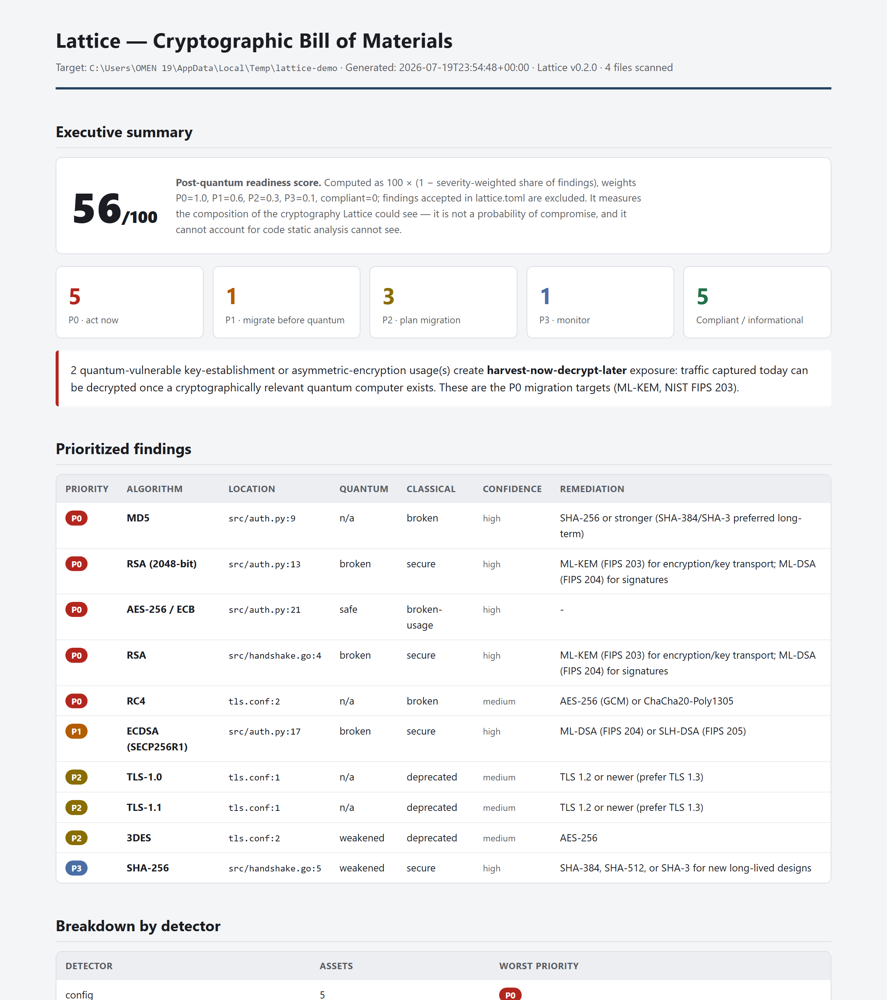
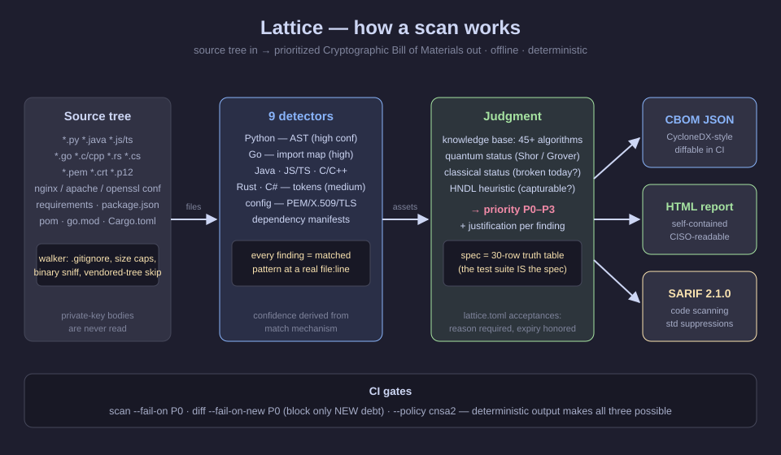
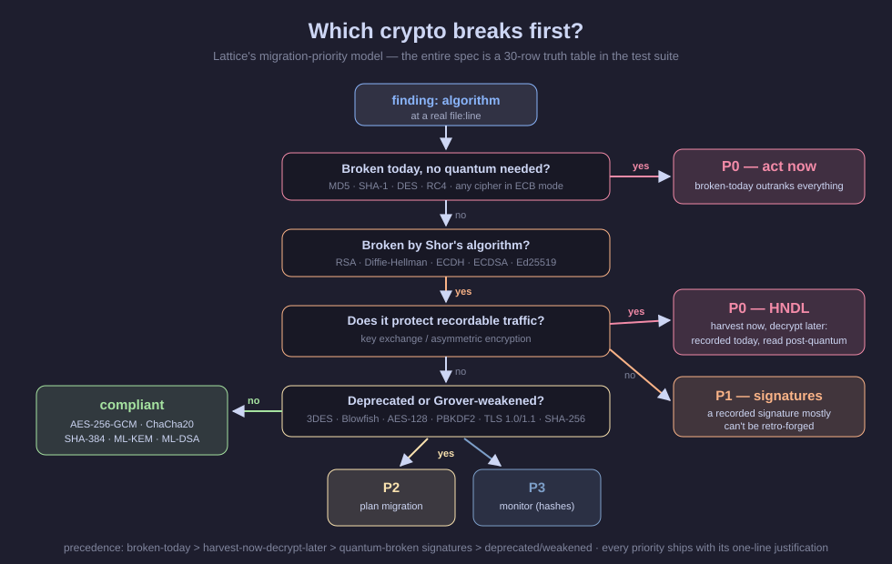

# Lattice, Explained Simply

*A plain-language walkthrough of the whole project — for a recruiter, a manager, a
first-time contributor, or anyone who wants to understand what was built and why it
matters, without reading the source. Ten minutes, no cryptography background needed.*

---

## 1. The problem, in three sentences

Most of the world's encryption (RSA, elliptic curves) will be breakable by a future
quantum computer — and encrypted data **recorded today can simply be stored and decrypted
then** ("harvest now, decrypt later"). The replacements are already standardized (NIST
FIPS 203/204/205, August 2024), but you can't migrate cryptography you can't find, and it
hides in code, config files, certificates, and dependencies across every language.
**Lattice finds it, grades it, and tells you what to fix first.**

## 2. What Lattice is

Lattice is an open-source command-line tool. You point it at a folder of code:

```bash
pip install .          # zero dependencies, works offline
lattice scan .
```

and it produces a **CBOM — a Cryptographic Bill of Materials**: a complete inventory of
every cryptographic thing it found, in three formats at once:

| Output | Who it's for |
|---|---|
| `cbom.json` | machines — compliance tooling, CI pipelines (CycloneDX-style) |
| `report.html` | humans — a single self-contained page with an executive summary, works offline, light & dark mode |
| `findings.sarif` | GitHub — findings appear inline on pull requests |

The HTML report — one self-contained file, readable by a CISO, in light or dark theme:





## 3. The core idea: not "is it safe?" but "what breaks first?"

Every finding gets a **migration priority**, P0 (act now) to P3 (monitor), from two
independent judgments plus one insight:

- **Classical risk** — is it broken *today*? (MD5, SHA-1, DES, RC4, ECB mode → yes)
- **Quantum risk** — will Shor's algorithm break it? (RSA, Diffie-Hellman, all elliptic
  curves → yes) Will Grover's algorithm merely weaken it? (AES-128, SHA-256 → yes)
- **The harvest-now-decrypt-later insight** — quantum-broken *key exchange* is worse
  than quantum-broken *signatures*, because recorded traffic can be decrypted later but
  a recorded signature mostly can't be retro-forged.



So: MD5 → **P0** (broken today). RSA key exchange → **P0** (recordable traffic). ECDSA
signature → **P1**. AES-128 → **P2**. SHA-256 → **P3**. AES-256-GCM, ChaCha20, ML-KEM →
**compliant**. The whole model is specified as a ~30-row truth table that the test suite
enforces — when someone disagrees with a judgment, the argument is about one row.

A **readiness score (0–100)** summarizes the scan, and its formula is printed next to the
number in every report — no black boxes.

## 4. What it can see (12 languages + config + dependencies)

| Detector | How it works | Confidence |
|---|---|---|
| Python | real AST parsing — aliased imports can't hide; infers AES key sizes from context | high |
| Go | import mapping — unused imports don't compile, so an import is near-proof | high |
| Java/Kotlin/Scala | parses JCA strings like `"AES/ECB/PKCS5Padding"` into algorithm + mode | medium |
| JavaScript/TS | node:crypto calls, WebCrypto params, cipher triples like `aes-128-ecb` | medium |
| C/C++ | OpenSSL/mbedTLS/libsodium tokens (`EVP_aes_128_ecb`, `crypto_sign_...`) | medium |
| Rust | RustCrypto crates, the `openssl` crate, `ring` constants | medium |
| C#/.NET | `System.Security.Cryptography` types, `CipherMode` binding | medium |
| Ruby | OpenSSL stdlib (`OpenSSL::Cipher`, `OpenSSL::PKey`) + bcrypt/argon2 gems | medium |
| PHP | `openssl_*`, `hash()`/`password_hash()`, the Sodium extension | medium |
| Swift | CryptoKit (`Insecure.MD5`, `P256.Signing`, `AES.GCM`) + CommonCrypto | medium |
| Config & keys | PEM headers, X.509 certificates (a small hardened DER parser reads only the algorithm identifiers), SSH keys, nginx/Apache TLS directives | high |
| Dependencies | crypto libraries named in requirements.txt, package.json, pom.xml, go.mod, Cargo.toml… | high (presence) |

Two honesty rules apply everywhere: **every finding traces to a real file and line**
(nothing is guessed), and **every finding carries a confidence level** derived from *how*
it was matched — an AST parse is not the same evidence as a regex hit, and the reports
say so.

## 5. The safety rule that matters most

Lattice reads the most sensitive files in any company — private keys. It identifies them
**by header only and never reads the body**. Snippets pass a redaction filter. And a test
plants a fake key in the fixtures and asserts its bytes appear in **zero** output
formats. No network code exists anywhere in the package. (Full statement:
[THREAT_MODEL.md](THREAT_MODEL.md).)

## 6. Built for a migration's lifecycle, not just a one-off scan

- **CI gate** — `lattice scan . --fail-on P0` fails the build while critical findings exist.
- **Accepted risks** — real codebases have exceptions (MD5 as a cache key). In
  `lattice.toml` you *accept* a finding with a **mandatory reason** and optional expiry.
  It leaves the gate and the score but **stays visible in every report** — an inventory
  that hides things isn't an inventory.
- **Drift detection** — because output is deterministic (same input → byte-identical
  output), two CBOMs can be diffed: `lattice diff old.json new.json --fail-on-new P0`
  blocks a pull request that *introduces* weak crypto without punishing pre-existing debt.
  Drift can be emitted as text or JSON (`--format json --out drift.json`).
- **Policy packs** — `--policy cnsa2|cnsa1|fips140` additionally checks findings against a
  named compliance suite (compliance is a different question from security, so it's a
  separate layer).
- **Repo config** — a `lattice.toml` `[scan]` table holds default `exclude`, `languages`,
  `fail_on`, and `max_file_bytes`, so CI jobs don't re-pass the same flags.

## 7. Does it actually work? (evidence, not claims)

Tested against real public projects, with samples hand-verified
([ACCURACY_NOTES.md](ACCURACY_NOTES.md)):

| Project | What Lattice found | Score |
|---|---|---|
| `age` (modern encryption tool) | exactly its published design: ChaCha20-Poly1305 + X25519 + scrypt | 62/100 |
| `paramiko` (Python SSH) | ECDH/ECDSA/RSA key exchange, SHA-1 host hashing, MD5 fingerprints | 54/100 |
| `node-jsonwebtoken` (JWT) | RSA ×11, ECDSA ×7 — every RS256/ES256 signature | 26/100 |
| CPython's entire stdlib | 173 findings across ~5,800 files in 72 s, zero crashes | — |

The interesting one is `age`: one of the best-designed modern crypto tools scores 62,
because its X25519 key exchange is exactly the harvest-now-decrypt-later shape. **Even
excellent modern cryptography is pre-quantum cryptography** — that's the size of the
industry's migration, and the reason this tool exists.

Known limitations are documented, deliberately and in detail, in the
[README's Limitations section](../README.md#limitations-read-this-before-trusting-a-report)
— static analysis can't see runtime-chosen algorithms, regex detectors have false
positives, and an inventory is not a proof of correct usage.

## 8. How it's built (for the engineers)

- **~3,000 lines of Python 3.11+, zero runtime dependencies** (every dependency is a
  supply-chain liability in a security tool), Apache-2.0.
- **Architecture**: `rules/` (the knowledge base — 45+ algorithms with quantum/classical
  status and PQC replacements) ← `core/` (models, scoring, walker, engine, diff, policy,
  suppressions) ← `detectors/` and `emitters/`. Core never imports a detector or emitter.
- **171 tests, ~90% coverage**: a scoring truth table, per-language known-answer fixtures
  (false negatives never acceptable), byte-determinism tests for all three formats,
  secret-leak guards, and fuzzing for the DER/config parsers. Ruff + mypy clean; CI
  dogfoods the tool on its own fixtures and requires the P0 gate to trip.
- **Process**: built spine-first (knowledge base + scoring before any detector), then one
  language end-to-end, then fan-out — each phase behind a hard gate. The full plan is in
  [LATTICE_EXECUTION_PLAN.md](LATTICE_EXECUTION_PLAN.md).

## 9. Where this sits in the ecosystem

The main prior art is PQCA/IBM's **CBOMkit** (SonarQube plugin, Java + Python). Lattice's
lane: **zero infrastructure, 12 languages, prioritized output instead of a yes/no
whitelist, and the CI lifecycle** (gate → accept → diff). Full honest comparison,
including where the alternatives are stronger: [COMPARISON.md](COMPARISON.md).

## 10. Try it in 60 seconds

```bash
git clone <repo> && cd lattice && pip install .
lattice scan tests/fixtures --format all --out demo
# open demo/report.html — you'll see P0s (they're planted fixtures)
lattice rules list        # the entire knowledge base as a table
```

## Glossary

| Term | Plain meaning |
|---|---|
| **CBOM** | Cryptographic Bill of Materials — a complete list of the crypto in a system |
| **PQC** | Post-quantum cryptography — algorithms that survive quantum computers |
| **HNDL** | Harvest now, decrypt later — record ciphertext today, decrypt when quantum arrives |
| **Shor / Grover** | The two quantum algorithms: Shor *breaks* RSA/ECC; Grover *halves* symmetric strength |
| **ML-KEM / ML-DSA** | The NIST-standardized replacements (FIPS 203 / 204) |
| **SARIF** | The standard findings format GitHub code scanning understands |
| **Deterministic output** | Same input → byte-identical report, which makes reports diffable |
