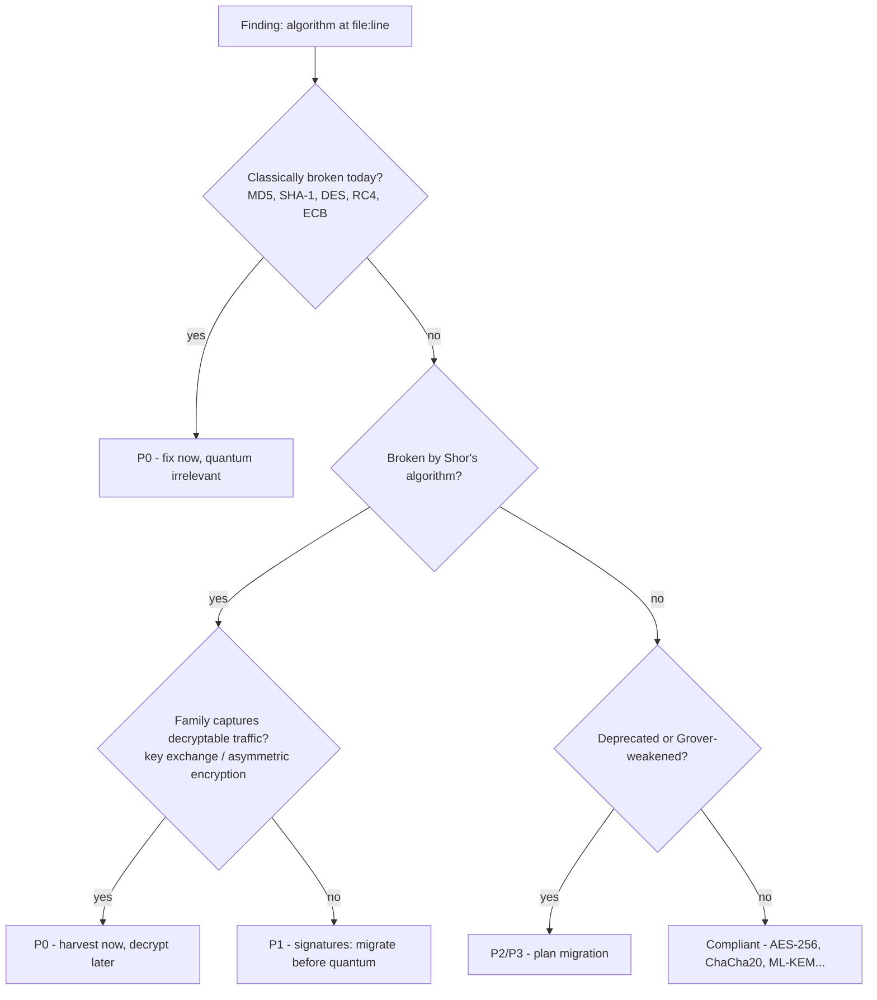

# I Built Lattice: An Open-Source Scanner That Tells You Which of Your Crypto a Quantum Computer Will Break First

> **Playbook meta** — Angle: "I built X — here's what I learned" · Audience: security engineers, backend devs, engineering managers · Target length: ~2,100 words · Primary keyword: *post-quantum readiness scanner* · Slug: `i-built-lattice-post-quantum-cbom-scanner`

---

In August 2024, NIST published the standards that will replace almost every public-key algorithm your code uses today — ML-KEM (FIPS 203) and ML-DSA (FIPS 204). Not because RSA is broken *now*, but because encrypted traffic recorded *now* can be decrypted the day a large quantum computer exists. The attack even has a name: **harvest now, decrypt later**.

So I asked a simple question about my own projects: *which of my crypto would break first?* I couldn't answer it. Neither could any tool I could install in under an hour. So I built one.

> **TL;DR**
> - **Lattice** is an open-source CLI that scans a codebase and produces a **Cryptographic Bill of Materials (CBOM)** — every algorithm, key file, TLS config, and crypto dependency it can find.
> - Every finding gets **two grades** (quantum risk, classical risk) and a **migration priority P0–P3**, with harvest-now-decrypt-later exposure weighted explicitly.
> - It covers **9 languages** (Python via AST, Java, JS/TS, Go, C/C++, Rust, C#), plus PEM/X.509 material and dependency manifests — with `pip install`, zero runtime dependencies, fully offline.
> - Output is **deterministic**, so `lattice diff` can block a PR that *introduces* weak crypto without failing on pre-existing debt.

[SCREENSHOT: terminal running `lattice scan . --format all --fail-on P0` showing the priorities summary and readiness score]

## Why "which breaks first" is the only question that matters

Every PQC article tells you to "start migrating." Almost none tell you where to start, and "everywhere" is not a plan.

The insight that shaped Lattice's scoring model: **not all quantum-broken crypto is equally urgent.**

- An **RSA key exchange** protecting traffic today is a P0 emergency — an adversary can record that ciphertext and decrypt it retroactively. The data is already lost; you just don't know it yet.
- An **ECDSA signature** is quantum-broken too, but a recorded signature mostly can't be retro-forged. It's a P1: migrate before quantum arrives, not before lunch.
- **MD5 is broken today**, no quantum computer required. Broken-today always outranks broken-later.

Think of it like a building inspection. A cracked foundation (MD5, SHA-1, ECB mode) gets fixed before the roof that will fail in the next big storm (RSA key exchange), which gets fixed before the paint that's merely out of code (AES-128).



## What Lattice actually does

One command:

```bash
pip install lattice-scanner   # zero runtime dependencies, stdlib only
lattice scan . --format all --fail-on P0
```

You get three artifacts from one scan:

- **`cbom.json`** — a CycloneDX-style CBOM: the machine-readable compliance inventory.
- **`report.html`** — a single self-contained file (works with WiFi off) with an executive summary, a readiness score whose formula is printed right next to it, and every finding with its file, line, snippet, and justification.
- **`findings.sarif`** — SARIF 2.1.0, so findings appear inline in GitHub code scanning.

[SCREENSHOT: the HTML report executive summary — score, P0–P3 cards, HNDL headline]

The detection layer is deliberately boring: Python gets a real AST walk (aliased imports and all), Go gets import-mapping (unused imports don't compile, so an import *is* evidence), and Java/JS/C/C++/Rust/C# get carefully-scoped token matching. Boring is the point — every finding traces to a concrete matched pattern at a real line, or it isn't reported.

## The three design rules I refused to break

**1. Every claim carries its confidence.** An AST match in Python is `high`. A regex hit on a Java string literal is `medium`. A token in a file that wouldn't parse is `low` — and the HTML report visibly badges it. A scanner that overstates certainty gets one false positive of trust and then gets uninstalled.

**2. Same input, same output — byte-identical.** Sort order is pinned, one timestamp lives at the top level, everything else is stable. This sounds like pedantry until you realize it's what makes a CBOM *diffable*:

```bash
lattice scan . --format cbom --out baseline   # on main
lattice scan . --format cbom --out current    # on the PR branch
lattice diff baseline/cbom.json current/cbom.json --fail-on-new P0
```

That last command is, I think, the most useful thing in the tool: it fails CI only when a PR **introduces** weak crypto. Legacy debt doesn't block the build; new debt does.

**3. Never touch key material.** Lattice detects private keys by header and extension only. The body is never decoded, never stored, never echoed. Snippets pass through a redaction filter that masks anything resembling secret material. There's a test that asserts the fixture key bytes appear in *zero* output formats — it's the test I'd least like to see deleted.

> **The one insight to steal even if you never use Lattice:** inventory and judgment must be separable. A finding you've consciously accepted should leave your CI gate but *never* leave your inventory — hiding it is how audits fail.

That's why suppression in Lattice is an *acceptance*, not a mute button:

```toml
# lattice.toml
[[accept]]
algorithm = "MD5"
path = "legacy/cache/**"
reason = "non-security cache key; removal tracked in TICKET-123"
expires = 2027-01-01
```

The finding stays in every report, visibly marked "accepted" with the reason. It stops failing CI. When the acceptance expires, it comes back. An acceptance without a `reason` is rejected — an unexplained suppression is a lie waiting for an auditor.

## Testing it on real code (numbers from real runs, not a brochure)

I ran Lattice over three public projects with very different crypto personalities:

| Project | Findings | Readiness | What it found |
|---|---|---|---|
| `FiloSottile/age` (modern encryption tool) | 30 | 62/100 | ChaCha20-Poly1305 ×8, X25519 ×5, scrypt — exactly age's published design |
| `paramiko/paramiko` (Python SSH) | 43 | 54/100 | ECDH/ECDSA/RSA kex + hostkeys, SHA-1 host hashing, MD5 fingerprints |
| `auth0/node-jsonwebtoken` (JWT) | 25 | 26/100 | RSA ×11 and ECDSA ×7 — a JWT library is a museum of quantum-broken signatures |

Two things surprised me.

First, **age scored 62, not 95** — the most thoughtfully-designed encryption tool in the sample still carries X25519 key exchange, which is exactly the harvest-now-decrypt-later shape. That's not a criticism of age; it's the whole point of the PQC migration. Even excellent modern crypto is pre-quantum crypto.

Second, **the scanner's mistakes taught me more than its hits.** In `node-jsonwebtoken`, RSA is used for *signatures* (RS256), which deserves P1 — but a bare `generateKeyPair('rsa')` call can't prove that statically, so Lattice scores it conservatively as P0. I documented that bias instead of hiding it ([`docs/ACCURACY_NOTES.md`](../docs/ACCURACY_NOTES.md)). A security tool's blind spots belong in its README, not in its issue tracker after someone gets burned.

[VISUAL: side-by-side bar chart of the three repos' priority distributions — data in docs/ACCURACY_NOTES.md]

## What exists already (and why I still built this)

Prior art exists and it's good: IBM donated its CBOM tooling to the Post-Quantum Cryptography Alliance as **CBOMkit**, whose scanner is a SonarQube plugin covering Java and Python, with a service that needs a database and a frontend. Semgrep and CodeQL can flag weak crypto patterns but produce findings, not an inventory. TLS scanners see live endpoints, not source.

Lattice's lane is different: **zero infrastructure, nine languages, prioritized output, CI-native lifecycle** (gate → accept → diff). The full honest comparison — including where the alternatives are stronger — is in [`docs/COMPARISON.md`](../docs/COMPARISON.md).

Hot take: **most organizations don't need a "quantum readiness platform." They need a diffable text file and a CI gate.** The platform can come later; the inventory can't.

## Key takeaways

- **Ask "which breaks first,"** not "are we quantum-safe" — prioritization is the deliverable.
- **Treat harvest-now-decrypt-later as a today-problem**: key exchange and asymmetric encryption of long-lived data are P0 the moment the traffic can be recorded.
- **Fix broken-today first**: MD5/SHA-1/ECB outrank every quantum concern.
- **Demand determinism from your scanners** — it's the difference between a report and a gate.
- **Make suppressions auditable**: reason required, expiry supported, finding never hidden.
- **Run one scan this week**: `pip install`, one command, read the P0 list. That's the entire barrier to starting your PQC migration.

## Further reading

- [NIST post-quantum cryptography project](https://csrc.nist.gov/projects/post-quantum-cryptography) — the standards (FIPS 203/204/205) and timelines.
- [CBOMkit (PQCA)](https://github.com/cbomkit/cbomkit) — the prior art this builds beside; use it if you live in SonarQube.
- [CycloneDX CBOM spec](https://cyclonedx.org/capabilities/cbom/) — the format Lattice's JSON output follows.
- [age](https://github.com/FiloSottile/age) — the best example of modern pre-quantum crypto design, and one of the audit targets above.
- [Lattice on GitHub](REPO_URL_PLACEHOLDER) — source, docs, and the accuracy notes quoted in this post.

---

*Personal-voice checkpoints (fill before publishing — playbook Phase 3 is non-negotiable): (1) replace the opening "my own projects" framing with the actual project/story that made you ask the question; (2) add 1–2 sentences about the hardest bug — e.g. the walking-skeleton gate or the DER parser fuzzing; (3) the hot take above is a starting point — sharpen it to something you'd defend in comments.*
