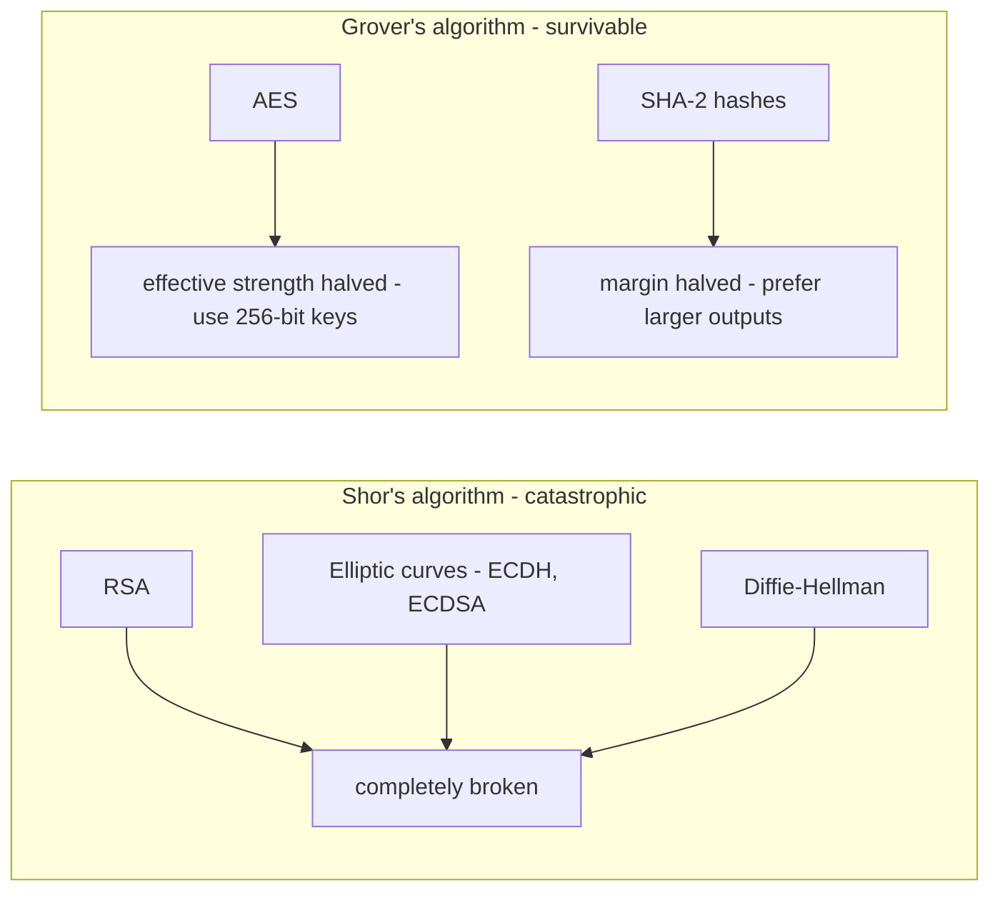

# Harvest Now, Decrypt Later: The Data Breach That Already Happened — You Just Can't See It Yet

> **Playbook meta** — Angle: "Why X is dangerous" · Audience: **mixed technical + non-technical** (CISOs, PMs, engineers, curious readers) · Target length: ~1,900 words · Primary keyword: *harvest now decrypt later* · Slug: `harvest-now-decrypt-later-explained`

---

Somewhere, right now, encrypted traffic is being recorded by people who cannot read it. They are not frustrated. They are patient. Their bet is simple: the encryption protecting that traffic will not survive the next couple of decades — and much of what's inside will still matter when it falls.

This strategy has a name — **harvest now, decrypt later** — and it is the reason the US government set 2035 targets for moving its systems off today's public-key cryptography, and why NIST published replacement algorithms in 2024. This post explains the whole thing with no math, and ends with the one question to ask your engineering team.

> **TL;DR**
> - Today's public-key encryption (RSA, elliptic curves) is broken by a **large quantum computer** running Shor's algorithm. That computer doesn't exist yet — but **recorded ciphertext waits**.
> - Data with a long shelf life — health records, legal documents, state secrets, infrastructure designs — can be **stolen encrypted today and read later**.
> - The fix exists: NIST standardized **post-quantum algorithms** (ML-KEM, ML-DSA) in August 2024. The hard part isn't the new math — it's **finding every place the old math is used**.
> - That inventory has a name — a **CBOM, a Cryptographic Bill of Materials** — and producing one is a one-command job with open-source tooling.

## The lock and the locksmith

Imagine every secret your organization sends is a letter in a locked box. The locks are excellent — the best mathematicians of the 20th century designed them, and nobody today can pick them.

Now imagine a thief who steals the boxes anyway and stacks them in a warehouse. Colleagues laugh: he can't open any of them. He shrugs — he's read the locksmith journals. A new kind of drill is coming. Not this year. But the boxes aren't going anywhere, and neither is what's inside.

The question that decides whether you should care is not "when does the drill arrive?" It's: **"which of my letters will still be secret-worthy when it does?"**

- Yesterday's marketing metrics? Worthless in a decade. Don't worry about those boxes.
- Medical histories, genomic data, merger negotiations, weapons designs, source code, diplomatic cables? Those keep their value for 25+ years. **Those boxes are already lost** if someone warehoused them — we just can't see the loss yet.

[VISUAL: timeline graphic — "data recorded (today)" → "quantum computer arrives (unknown year)" → "data decrypted" — with a shaded band showing "shelf life of your data" overlapping the decryption point]

## The two algorithms doing the breaking (30-second version, no math)

Quantum computers don't break "encryption" wholesale. They break specific mathematical problems, via two known algorithms:



- **Shor's algorithm** destroys the math behind essentially all public-key crypto in use today: RSA and elliptic curves. That's the crypto that protects the *start* of every HTTPS connection, every VPN handshake, every SSH session.
- **Grover's algorithm** merely *weakens* symmetric ciphers like AES — the fix is bigger keys (AES-256), which we already have.

That asymmetry is the entire story. The symmetric locks survive; the **key exchange** that delivers those locks' keys does not. Capture the handshake plus the traffic today, break the handshake later, and the whole conversation opens.

## "But quantum computers can't do this yet" — correct, and irrelevant

Both things are true:

1. No quantum computer today can break RSA-2048. Estimates of when one might range from the 2030s to "much later." Anyone giving you a confident year is selling something.
2. **The migration takes a decade anyway.** The last two crypto transitions (DES→AES, SHA-1→SHA-2) each took 10–15 years across the industry — and those didn't require re-architecting key exchange. Government mandates already reflect this: NIST's guidance points at 2030–2035 for deprecating and disallowing today's public-key algorithms, and the NSA's CNSA 2.0 timeline requires national-security systems to complete the transition by 2033.

So the race isn't "quantum computer vs. your data." It's **quantum computer vs. your migration project** — and the migration project hasn't started at most companies.

> **The single most important insight:** for long-lived data, the breach window opened the day an adversary started recording. Migration urgency is set by your *data's shelf life*, not by quantum hardware progress.

## Why step one is an inventory (and why nobody has one)

Ask an engineering team "where do we use RSA?" and watch what happens. Cryptography hides *everywhere*:

- in code (`generateKeyPair('rsa')`, `Cipher.getInstance("AES/ECB/...")`),
- in certificate and key files sitting in repos and build pipelines,
- in TLS configuration (`ssl_protocols TLSv1.1`),
- inside dependencies nobody has read.

The industry's answer is the **CBOM — Cryptographic Bill of Materials** — the crypto sibling of the software bill of materials (SBOM) that became standard after the supply-chain attacks of the early 2020s. It's a machine-readable list of every cryptographic asset you have, where it lives, and how worried you should be about each.

This is now a one-command job. I built an open-source tool, **Lattice**, that produces one:

```bash
pip install lattice-scanner
lattice scan . 
```

It emits a report a non-engineer can read: a readiness score, a P0-to-P3 priority list, and — crucially — a specific flag for harvest-now-decrypt-later exposure, because a quantum-broken *key exchange* (recordable traffic, P0) and a quantum-broken *signature* (little retroactive value, P1) are very different emergencies.

[SCREENSHOT: Lattice HTML report — executive summary with the HNDL headline banner]

Real example: scanning `age` — one of the most respected modern encryption tools — Lattice found exactly what its designer published: ChaCha20-Poly1305 (quantum-fine) built on X25519 key exchange (quantum-broken, HNDL-shaped). Readiness: 62/100. **Even excellent modern cryptography is pre-quantum cryptography.** That's not an insult; it's the size of the industry's homework.

## What to actually do (in order)

1. **Classify your data by shelf life.** Anything that must stay confidential past ~2035 defines your urgency. This is a business exercise, not a technical one.
2. **Build the CBOM.** One scan per repo. You cannot prioritize what you haven't listed.
3. **Fix the already-broken first.** Scanners routinely find MD5, SHA-1, and ECB mode — broken *today*, no quantum computer required. Zero-regret fixes.
4. **Target key exchange before signatures.** HNDL makes key establishment the quantum-urgent half. The destination is ML-KEM (NIST FIPS 203); early deployments run it *hybrid* alongside X25519, so you're never weaker than today.
5. **Stop new debt.** A CI gate that blocks *newly introduced* weak crypto costs one line in a pipeline and ends the bleeding while you drain the pool.

## Key takeaways

- **Assume long-lived encrypted data is being recorded** — the strategy is documented, cheap, and invisible.
- **Judge urgency by data shelf life**, not by quantum-hardware headlines.
- **Start with the inventory** — a CBOM turns "are we ready?" from a shrug into a number.
- **Fix broken-today crypto immediately**; it outranks everything quantum.
- **Migrate key exchange first** (ML-KEM, ideally hybrid), signatures second.
- **Ask your team the one question:** "If I asked for our cryptographic inventory, how long would it take?" If the answer is a shrug — that's the project.

## Further reading

- [NIST announcement of the first finalized PQC standards](https://www.nist.gov/news-events/news/2024/08/nist-releases-first-3-finalized-post-quantum-encryption-standards) — FIPS 203/204/205, August 2024.
- [NSA CNSA 2.0 FAQ](https://www.nsa.gov/Press-Room/News-Highlights/Article/Article/3148990/nsa-releases-future-quantum-resistant-qr-algorithm-requirements-for-national-s/) — the 2033 mandate for national-security systems.
- [CycloneDX CBOM](https://cyclonedx.org/capabilities/cbom/) — the inventory format.
- [Cloudflare on post-quantum TLS](https://blog.cloudflare.com/pq-2024/) — hybrid key exchange running on real traffic today.
- [Lattice on GitHub](REPO_URL_PLACEHOLDER) — the open-source scanner used in this post.

---

*Personal-voice checkpoints: (1) open section "Why step one is an inventory" with the moment you realized you couldn't answer the RSA question for your own code; (2) consider a hot take for the comments — e.g. "If your vendor's PQC story is a slide deck and not a CBOM export, they don't have a PQC story."*
